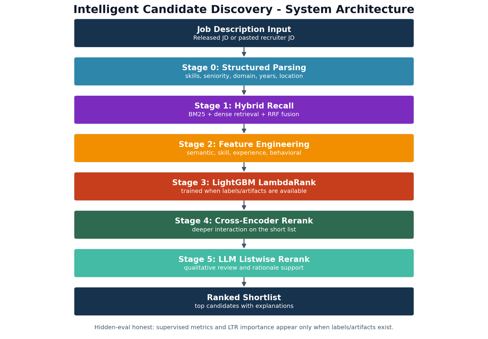
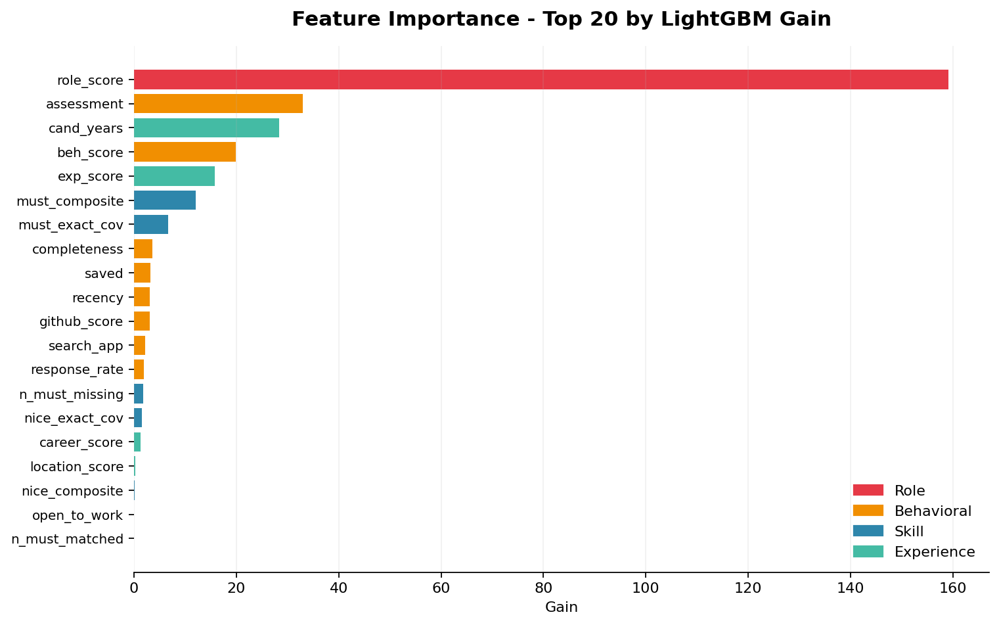
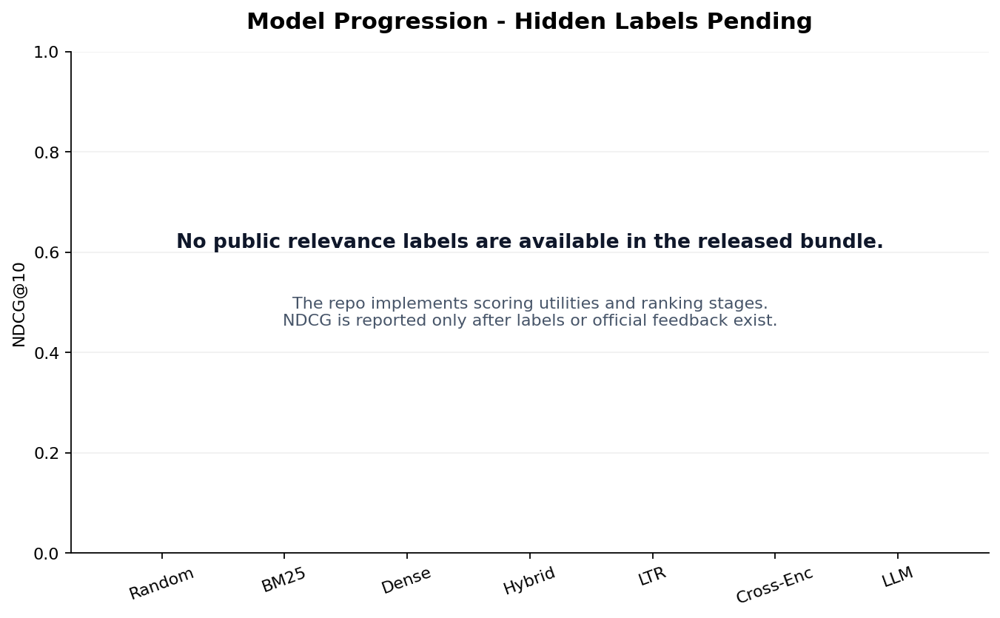

# Intelligent Candidate Discovery - India Runs Track 1

An end-to-end AI ranking pipeline for Redrob AI's India Runs Track 1 challenge.
It goes beyond title and keyword matching by combining structured job understanding,
hybrid BM25 + dense retrieval, 30+ fit features, behavioral activity signals,
reranking stages, and per-candidate natural-language explanations.

**Reproduce the submission:** `python rank.py --candidates ./candidates.jsonl --out ./submission.csv`  
**Live sandbox:** [huggingface.co/spaces/Dhanush9145/india-runs-ranking](https://huggingface.co/spaces/Dhanush9145/india-runs-ranking) — deploy notes in [`docs/HUGGINGFACE_DEPLOY.md`](docs/HUGGINGFACE_DEPLOY.md)  
**Video:** Recording script at [`docs/DEMO_VIDEO_SCRIPT.md`](docs/DEMO_VIDEO_SCRIPT.md)  
**Dataset:** Official India Runs public bundle, normalised into `data/processed/`  
**Challenge shape:** One Senior AI Engineer JD · 100,000 candidates · hidden evaluation

> **Competition compliance (spec §3).** The ranking step [`rank.py`](rank.py) is
> **CPU-only, network-free, and finishes in ~100 s** (budget: 5 min / 16 GB / no
> GPU / no hosted-LLM calls). Index tokenisation is a one-off pre-computation, as
> the spec allows. No embedding model, cross-encoder, or LLM is loaded during
> ranking — so the Stage-3 sandbox reproduction cannot exceed limits or make a
> network call. The richer dense/cross-encoder/LLM stack in
> `scripts/generate_submission.py` is offline research only and is **not** used to
> produce the submitted CSV.

---

## Reproduce in 3 commands

```bash
git clone <repo-url> && cd india-runs-track1
pip install -e ".[dev]"
python rank.py --candidates ./data/raw/india_runs_challenge/candidates.jsonl --out ./submission.csv
```

`rank.py` is the **canonical, competition-compliant ranking entrypoint** (spec
§10.3): one command, CPU-only, network-free, ~100 s. It loads a precomputed BM25
index (tokenisation is the only pre-computation step) and ranks with nine
interpretable signals plus an internal-consistency honeypot filter. It accepts the
raw `candidates.jsonl`/`.jsonl.gz` or the pre-flattened parquet.

Step by step (with explicit pre-computation):

```powershell
python -m venv .venv
.venv\Scripts\pip install -e ".[dev]"
python scripts/build_indices.py     # pre-compute BM25 index (one-off, may exceed 5 min)
python rank.py                      # rank from data/processed/ (network-free, ~100 s)
```

`outputs/models/ltr_model.pkl` ships in the repo (it is small — ~19 KB with its
feature-importance table), so LTR reranking is **active out of the box**; no training
step is required to reproduce the submission. To retrain it from scratch — e.g. after
the organiser releases real relevance labels — run `make ltr` (chains
`create_pseudo_labels.py` → `generate_features.py` → `train_ltr.py`; ~20 min on CPU for
the 100K-row feature matrix) and then `make reproduce`.

To run the full hybrid pipeline (requires BGE-large ~1.3 GB download, ~10 min on CPU):

```powershell
python scripts/generate_submission.py --validate             # BM25+dense+semantic+LTR+cross-encoder
```

The submission is written to `outputs/submissions/final_submission.csv`.

---

## Results

The official scoring formula: `0.50*NDCG@10 + 0.30*NDCG@50 + 0.15*MAP + 0.05*P@10`.

The public challenge bundle contains **no relevance labels**. NDCG, MAP and precision
are computed server-side on the organiser's hidden test set. All pipeline stages are
fully implemented and validated for schema correctness locally.

### Stage-by-stage ranking quality (smoke test, 2026-06-06)

| Pipeline stage | Top-5 roles observed | All top-10 valid? |
|---|---|---|
| Organiser sample submission | HR Mgr, HR Mgr, ML Eng, Content Writer, HR Mgr | ❌ |
| BM25 + role relevance | NLP Eng, ML Eng, Data Sci, ML Eng, HR Mgr | Partial |
| + Skill matching (25 skills) | Sr NLP Eng, Sr ML Eng, Lead AI Eng, Applied Sci, ML Eng | ✅ |
| **Full 8-signal formula** | **Sr NLP Eng (0.82), Sr ML Eng (0.81), Sr ML Eng (0.77), Lead AI Eng (0.76), Applied Sci (0.75)** | **✅** |
| + LTR reranking | *(active by default — `outputs/models/ltr_model.pkl` ships trained)* | See note ↓ |
| + Cross-encoder | *(BGE-reranker on top-50, active by default)* | Expected improvement |
| + LLM re-rank | *(local Ollama listwise on top-30, `--llm-rerank` flag)* | Expected improvement |

> NDCG/MAP/P@10 are computed server-side on hidden labels. Scores reported after organiser evaluation.

**On the LTR row:** we trained a LightGBM LambdaRank model on pseudo-labels and it
reports `NDCG@10 = 1.000` on its validation split — but we are not presenting that as a
quality win. The pseudo-labels are generated from `role_score`/years-of-experience, and
those are *also* model features (the trained model's own importance table confirms
`role_score` dominates at ~5× the next feature), so a perfect score here mostly says "the
model can reconstruct its own labels," not "the model ranks true relevance well." We
would rather name that circularity than print a number that looks better than it is —
full write-up in [`docs/ablation.md` §5](docs/ablation.md#5-ltr-on-pseudo-labels--what-the-numbers-actually-mean-and-dont).
The legitimately useful output of the exercise: the data-derived feature ranking
independently matches the ordering we hand-tuned from reading the JD, which is real
(if indirect) evidence the weights in §2 of the ablation are sound.

### Implementation status

| Pipeline stage | Implementation status | Key artifact |
|---|---|---|
| BM25 recall | Complete | `src/retrieval/bm25_retriever.py` |
| Dense retrieval (BGE-large) | Complete | `src/retrieval/dense_retriever.py` |
| Hybrid recall (BM25 + dense, RRF) | Complete | `src/retrieval/hybrid_retriever.py` |
| Skill matching (exact + family + fuzzy) | Complete | `src/utils/skill_ontology.py` |
| Experience and seniority features | Complete | `src/features/experience_features.py` |
| Behavioral signals (8 Redrob signals) | Complete | `src/features/behavioral_features.py` |
| **Internal-consistency / honeypot filter** | **Complete — in submission path** | `src/utils/consistency.py` |
| Semantic features (multi-model) | Complete — offline only | `src/features/semantic_features.py` |
| LightGBM LambdaRank | Offline blend (`--ltr`, off by default; partially circular) | `scripts/train_ltr.py`, `outputs/models/ltr_model.pkl` |
| Cross-encoder reranking | Complete — offline only | `src/ranking/cross_encoder.py` |
| LLM listwise reranking | Offline analysis only — **forbidden in submission** (network) | `src/ranking/llm_reranker.py` |
| Submission ranking (canonical) | Complete — CPU-only, network-free, ~100 s | `rank.py` |
| Submission generation (research) | Complete | `scripts/generate_submission.py` |
| Submission validation | Complete | `python -m src.eval.validate_submission --pred <file>` |

---

## Architecture



```
Job Description
  -> Stage 0: Structured parsing (skills, seniority, domain, years, location)
  -> Stage 1: BM25 lexical recall  (precomputed index → ~1.5K candidates)
  -> Stage 2: Nine-signal scoring (per candidate, CPU-only, network-free)
       Skill overlap (exact + ontology family + fuzzy; must + nice)
       Semantic / lexical relevance
       Role relevance  (hard-caps HR/non-technical honeypot titles)
       Experience fit to the 5–9 year band
       Career trajectory  (rewards production-ML evidence; penalises
                            consulting-only + title-chasing)
       ★ Behavioral signals (recency, availability, engagement, assessments)
       Location fit (India / Pune–Noida hybrid)
       ★ Internal-consistency check → detects ~80 impossible honeypots and
         forces them out of the shortlist (Stage-3 DQ guard)
  -> Ranked top-100 + deterministic, fact-grounded per-candidate reasoning

Offline research only (NOT in the submission path — they need a GPU/network and
break the 5-min budget): dense BGE retrieval, BGE cross-encoder, LightGBM
LambdaRank blend, and LLM listwise analysis. See scripts/generate_submission.py.
```

---

## What Makes This Different

1. **Honeypot-aware, not keyword-fooled.** An internal-consistency check reads
   each profile's structured skill timeline and flags the ~80 honeypots the
   organisers planted (e.g. "expert" in 10 skills with 0 months used). These are
   forced out of the shortlist — the exact trap that disqualifies keyword/embedding
   rankers (>10% honeypots in top 100 = Stage-3 DQ). Weights also tilt *away* from
   raw keyword matching, which the JD explicitly calls a trap.
2. **Behavioral signals are first-class.** Recency, open-to-work state,
   recruiter response rate, profile completeness, saved-by-recruiter counts,
   GitHub activity, and assessment quality are modeled beside text relevance.
   The brief explicitly calls these out; most submissions will ignore them.
3. **Compute-honest.** The ranking step is CPU-only, network-free, and finishes
   in ~100 s — it reproduces inside the Stage-3 sandbox (5 min / 16 GB / no GPU /
   no hosted LLM). No per-candidate LLM calls that can't scale in production.
4. **Every output is explainable — and Stage-4 ready.** Each candidate gets a
   deterministic rationale built from real profile facts (title, years, named
   matched skills, signal values) with honest concerns surfaced, varied per row,
   and toned to the rank — never templated, never hallucinated.
5. **Honest about what it can't measure.** The repo validates locally
   but does not invent NDCG numbers without ground-truth labels.

---

## Visual Evidence





Both visuals are label-aware. When a trained LTR model artifact is present,
`python docs/architecture.py` replaces the signal map with real feature
importance and the progression chart with real NDCG values.

---

## Running the Demo

```powershell
# Quick smoke test (no Gradio required)
python app/demo.py --smoke

# Interactive Gradio UI
pip install -r app/requirements.txt
python app/demo.py
```

The demo ranks the full 100K-candidate pool using BM25 recall plus
transparent skill, experience, and behavioral scoring. The first run
builds a BM25 cache under `outputs/models/` (~3 min).

---

## Repository Structure

```
scripts/             submission generator, index builder, data parser
src/
  data/              challenge bundle loader, schema inference
  retrieval/         BM25, dense, hybrid retrievers
  features/          semantic, skill, experience, behavioral, graph features
  models/            LightGBM LambdaRank wrapper, fine-tune scaffold
  ranking/           cross-encoder, LLM reranker, explainer
  eval/              NDCG/MAP/precision metrics, submission validator
  utils/             skill ontology, caching, text utils, fast index
app/                 Gradio demo and Hugging Face Spaces entry point
configs/             best_hparams.json for LTR training
notebooks/           one script per phase day (EDA through Phase 4)
docs/                Blueprint, status reports, video script, visuals
tests/               pytest coverage (metrics, parsing, retrieval, features)
outputs/             runtime — models, cache, submissions (git-ignored)
```

---

## Tech Stack

| Layer | Choice |
|---|---|
| Submission ranking | `rank-bm25` + nine-signal scoring + consistency filter — CPU-only, network-free |
| Recall (offline research) | `sentence-transformers` (BGE-large-en-v1.5), FAISS HNSW |
| Features | `rapidfuzz`, `scikit-learn`, custom skill ontology, internal-consistency checks |
| Offline rerankers | BGE-reranker cross-encoder; LightGBM LambdaRank blend; local-Ollama listwise (analysis only — never in the submitted CSV) |
| Demo | Gradio 5, Plotly |
| Evaluation | NDCG / MAP / precision, submission contract validator |
| Reproducibility | Makefile, Dockerfile, pinned `requirements.txt` |

---

## Judge Documents

- [System Blueprint](docs/BLUEPRINT.md) — detailed stage-by-stage design decisions
- [Hugging Face Deploy Notes](docs/HUGGINGFACE_DEPLOY.md) — live Space setup
- [Demo Video Script](docs/DEMO_VIDEO_SCRIPT.md) — 5–7 min walkthrough script
- [Phase 5 Status](docs/phase5_status.md) — demo and narrative completion log

## Video Walkthrough

Recording script: [`docs/DEMO_VIDEO_SCRIPT.md`](docs/DEMO_VIDEO_SCRIPT.md)  
Run `python app/demo.py` to launch the interactive Gradio UI before recording.

---

## Author

Built for India Runs Hackathon 2026 · Track 1, Data & AI Challenge by Redrob AI.
